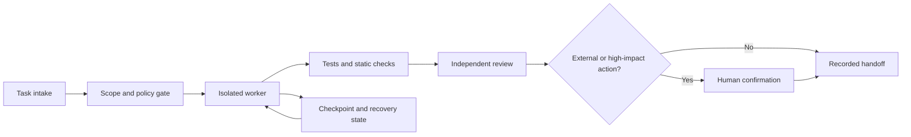

# AI Agent Infrastructure

## Context

I needed a repeatable way to use coding agents across personal software projects without allowing unattended tools to make high-impact decisions. The system had to support planning, implementation, review, scheduled maintenance, and handoff while preserving human control.

This case study describes the engineering approach. It intentionally omits private source, providers, hostnames, credentials, schedules, logs, identifiers, and infrastructure coordinates.

## My contribution

I designed the workflow boundaries, assembled the orchestration and review components, wrote reusable agent instructions and operational checks, tested failure paths, and maintained the runbooks. I also reviewed generated changes before they could reach protected branches or external systems.

## Constraints

- Agents needed the minimum access required for each task.
- Publishing, destructive changes, purchases, and account actions required explicit confirmation.
- A failed or interrupted run had to stop safely and leave enough evidence for recovery.
- Secrets and private project context could not appear in prompts, logs, public artifacts, or handoffs.
- Automated output had to pass tests and human review before release.

## Sanitized architecture

The task intake records the intended outcome and allowed surface. A policy gate narrows tools and files before work begins. Workers operate in isolated task contexts. Verification and review run before a handoff, and external or high-impact actions stop at a human confirmation gate.

## Confirmation controls

- Actions are classified by impact before execution.
- External publication, account changes, destructive operations, and new permissions require a fresh confirmation at action time.
- The confirmation names the exact target and proposed change.
- A changed target or unexpected permission prompt invalidates the confirmation and stops the run.
- Agents do not inspect passwords, cookies, payment data, or unrelated private state.

## Recovery behavior

- Each task records its scope, current state, completed checks, and remaining work.
- Work is split into reversible steps with checkpoints before external actions.
- Timeouts and tool failures stop the current step instead of silently retrying high-impact actions.
- A recovery run begins from the last verified state and repeats safety checks before continuing.
- Ambiguous partial completion is reported for human review.

## Testing and verification

The infrastructure uses layered checks appropriate to each project:

- Unit and integration tests for deterministic behavior
- Formatting, linting, type checks, and static analysis
- Diff review for scope and private-data leakage
- Link, secret, and configuration scans before publication
- Manual review of claims, screenshots, and external destinations
- Post-action verification when a human approves an external change

Passing automation is necessary but not sufficient. A human remains responsible for claims, permissions, releases, and public changes.

## Lessons

1. The safest agent is one with a narrow task and a clear stop condition.
2. Confirmation works best when it happens immediately before the action and names the exact target.
3. Recovery is a product feature, not an afterthought. Checkpoints and explicit state reduce duplicate or contradictory work.
4. Verification should be selected by risk. More tools do not compensate for weak scope or unclear evidence.
5. Public case studies can show engineering judgment without exposing private source or infrastructure.

## Disclosure boundary

This document is a sanitized account of personal engineering work. It does not describe employer systems or publish operational details that would enable access, replication, or abuse.
